# NoiseBarrierTool
FOR GERMAN VERSION SEE [BELOW](#Anleitung-NoiseBarrierTool)!

The **NoiseBarrierTool** consist of individual PythonParts and enables the axis-related creation of noise barriers both as 3D objects and 2D drawings. Bais for the creation is a 3D surface (polyhedron) as terrain and a 3D polyline as route axis. Each step of the complete workflow can be executed with an individual PythonPart:
- **DrawPath** to determine the initial path
- **RecalculatePath** to aligne a modified path
- **SavePathPoints** to save the geometry and object parameters
- **CreateWallComponents** to create a 3D model of the noise barrier
- **DrawWallElevations** to create 2D longitudinal views of the noise barrier
- **DrawWallSection** to create 2D sections of the noise barrier piles

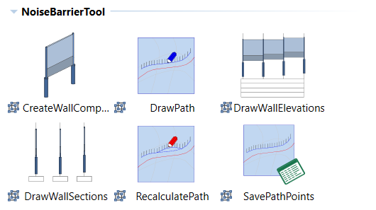

Altough related to each other, the workflow steps are more or less idependent. Therefor besides creating noise barrierss, the tool can also be used to calculate **route courses in a terrain** as placement basis for any kind of object. The ALLPLAN function **Copy along path** for example serves this purpose.

Another essential component of the tool is the Excel file **NoiseBarrierParameters.xlsx**. All parameters and key values of the noise barrier are saved and (re)calculated here.The file also enables the individual adaption and modification of each segment. In addition it can be used to retrieve coordinates and geometric values for further use, for example as basis for quantity or cost calculation.
Together with the other components, also several ***.rdlc  templates** are installed. They can be used to evaluate the 3D objects both as ALLPLAN reports or Excel tables. 

## Installation
The PythonPart **NoiseBarrierTool** can be installed directly from the Plugin Manager in ALLPLAN. 

Alternatively, the corresponding ***.allep** package can be downloaded from the [release page](https://github.com/AnkeNiedermaier/noise-barrier-public/releases). ***.allep** files are ALLPLAN internal setups that can be installed via drag and drop them into the program window.

At least the version 2026 is needed to install the PythonPart.

## Installed PythonPart Scripts
If the installation was successfull, the individual PythonParts of the **NoiseBarrierTool** as well as the Ecxel file **NoiseBarrierCalculation.xlsx** can be found
in the ALLPLAN Library:
`Library` →`Office` → `ALLPLAN GmbH` → `NoiseBarrierTool`
The ***.rdlc** files are also stored in the office folder:
`Office` → `Reports`→ `deu / eng` → `NoiseBarrierTool`
Besides the library, the individual PythonParts of the tool can also be found in the ActionBar in a newly created task area **NoiseBarrierTool** inside the task **Plug-ins**.

## Preparation
As mentioned, the basis for the tool are **3D polylines** and connected close **3D areas** in the form of surfaces/polyhedrons.

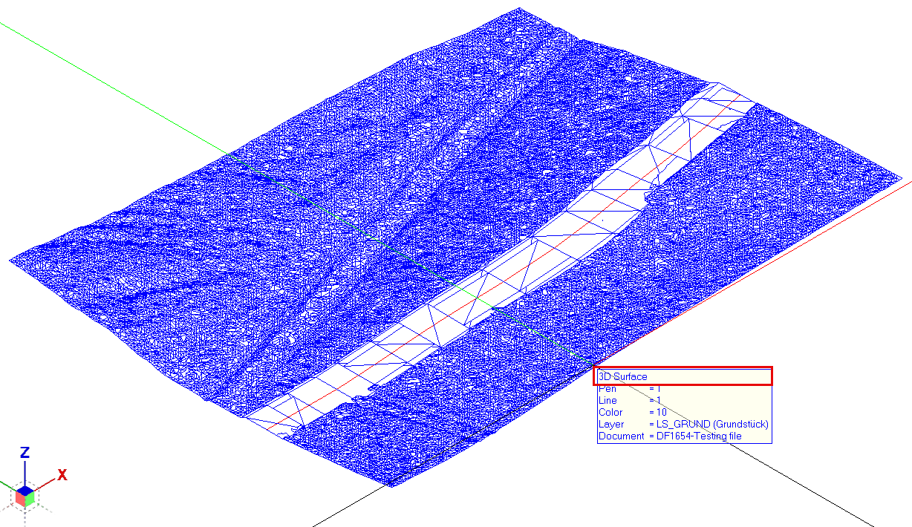          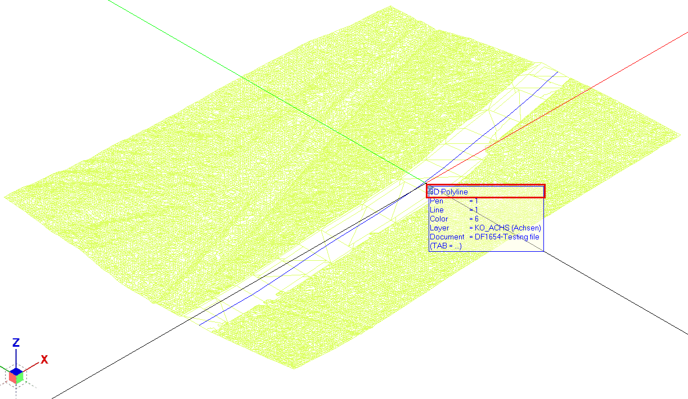

Therefor it might be necessary to convert the existing ALLPLAN objects into such types. This is done in using functions from the **Modeling** modul, mainly **Convert Elements** and **Shell**.

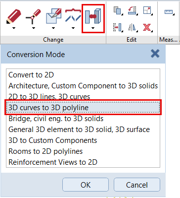           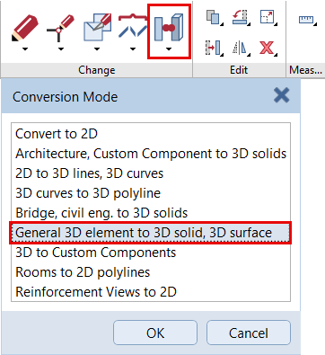

To union individual areas, the **Boolean operator** of the same name can be used, as it not only serves for 3D bodies. All objects intended as basis have to be on drawing files either in **active** or **edit mode**, as in reference mode a selection is not possible.

## Workflow

The complete workflow with all the options the tool offers, from drawing the inital path up to the evaluation of the wall components, contains several steps. Most of them are also represented by one of the individual PythonParts:
- **defining** the inital noise barrier path
- **modifying** it to fit the local conditions
- **recalculating** the the modified path
- **saving** coordinates and object parameters
- **adjusting** individual wall segments
- **creating** 3D models of the noise barrier
- **drawing** views and sections
- **evaluating** the 3D objects

Altgough they are executed separte and not necessarily sequently, initial definition and saving in the Excel file are mandatory to create objects or drawings in ALLPLAN. Therefor it is recommended to follow the described order and skip not needed steps inbetween the workflow.

In general, all installed PythonParts can be found in the **Library palette**, no matter if an additional ActionBar entry is created or not. They are started either with a **double-click** on the icon or per **Drag and Drop** into the viewport. This shows the corresponding Properties palette and executes the underlying skripts.
>**HINT**: the PythonPart palette contains the 3 common buttons **Save as a favorite**, **Load favorite** and **Restore basic settings** in the left bottom corner. They can be used to store and reread individual entered values which is mainly usefull for the wall and object parameters

 

##
### Step I: PythonPart DrawPath

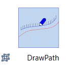 

Calculation of the inital noise barrier path concurrent to the existing route course polyline
- selection of the **terrain** (3D surface) and the **route axis** (3D polyline) in the given order
- input of the desired values for **path distance** from axis and **lenght** of the single segments
- definition of the axis part to take over, either **complete** or in entering a **start and end point** number
- definition of the **direction** (ascending/descending) of the calculation
- setting of the path and numbering **format** (pen, stroke, color, layer)

Once terrain and route are selected, a **preview**  is shown and can be adapted in changing the palette values. With the **Create** button the inital path is drawn as element group of a 3D polyline and 2D text in the current active drawing file. 
>**HINT**: as the palette stays open, it is possible to draw several paths at once with different distance and segmentation, also new sources for route and terrain can be choosen 
##
### Step II: Path modification
Modification of the path polyline directly in the ALLPLAN viewport with the common tools and functions
- move individual polyline points to another position
- add new points into segment with **Fold Line**
- remove points in draging them onto an adjacent one
- ...

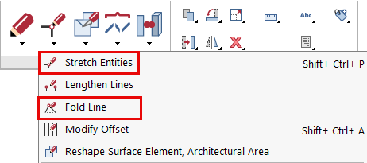 

> ⚠️ **IMPORTANT**:
> To make sure that the further workflow steps are executed correctly remaine **one** continuouse polyline. Therefor it might be necessary to union it again after modification with the **Combine Lines to Make Polylines** function

##
### Step III: PythonPart RecalculatePath

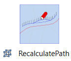 
Readjustment of the modified path to the terrain height or assignment of different segmentations to parts of the (modified) path. The procedure is almost identical with that in Step I

- selection of the **terrain** (3D surface) and the **route axis** (3D polyline)
- input of the desired **adoption kind**, either height adjustment or new calculation
- only with the second kind definition of the **part** to be recalculated, the desired **direction** and value for the **segment length**
- setting of the path and numbering **format** (pen, stroke, color, layer)
The preview shows the recalculated path course and can also be adapted again. With the **Create** button it is drawn similar to the initial one which therefor can be removed in checking the **Delete existing path** option. 
>**HINTS**: with the adoption kind adjust height the path course as such remains unchanged as only the Z value will be adapted 
successive adoptions of the same or another path can be taken at once as the palette stays open and also the whole step can be executed several times in a repetitive process

##
### Step IV: PythonPart SavePathPoints

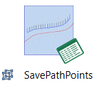 

> ⚠️ **IMPORTANT**:
> It is recommended to always use a copy of the Excel sheet or even Excel file and not overwrite the original one

Save the final path course togehter with the inital parameters of the noise barrier and its components in the **Excel file** delivered with the tool. For each of them the PythonPart contains a separate tab:
- Select calculation bases
    - selection of the **terrain** (3D surface), the **path course** (3D polyline) and the **route axis** (3D polyline)
    - input of the distance values for the parallel inner and outer **terrain course**
- Set wall parameters
    - input of the inital parameters related to the **complete wall**
    - selection of the **calculation method** for the plinth top
- Select object parameters - save points
    - input of the initial parameters for the individual **wall components** (pire, pile, plinth, panel)
    - selection of the **Excel file** and sheet

Once all calculation bases are selected, a **preview** shows the parallel terrain courses togehter with perpendicular lines from each path point to the route axis. With the **Save** button the desired geometry and parameter values are written to the Excel file and optional the perpendicular lines are drawn as construction lines in the active drawing file
>**HINTS**: it is only possible to set **one** global value for each wall and component parameter in the PythonPart during the **SavePoints** step. They can be adopted afterwards individually for each segment in the **Excel file**
the wall and object parameters already contain common start values, therefor it is not necessary to enter something in these tabs
several path courses can be saved in one step as long as the palette is open. To do so it is necessary to **copy the existing Excel file schema** sheet in andvance as only this sheet contains the formulas and cross references that are needed to finaly calculate the noise barrrier objects

##
### Step V: Individual adjustment 
> ⚠️ **IMPORTANT**:
> The **order and structure** within the Excel file is fixed and serves as basis for the object calculation and creation. Therefor it has to **be kept unchanged** and only cells with a **simple value** but none with **formulas or references** can be modified. Otherwise the execution of the script will throw errors or even no longer work at all

Modifying the initial general parameters of the wall components for each individual segment in the Excel file. Similar to the palette structure of the SavePoints PythonPart the can be found in the **General wall parameters** and  **Component parameters** section

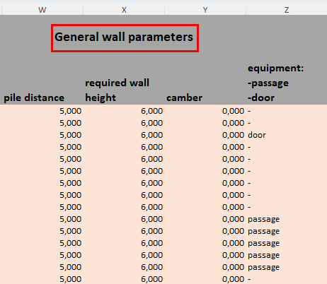               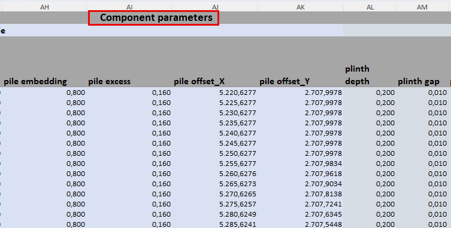

- required **height** and **camber** of segments
- wall **equipment**, currently either "door" or "passage"
- **dimensions** of the pire, pile, plinth and panel **geometry** like thickness or profile
- location and quantity of **glas panels** either as single or sequence of numbers or a mix of both separated by comma

    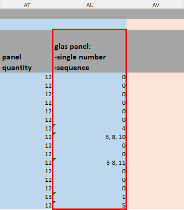    

    counting starts at the **bottom** and all numbers in a sequence are replaced with **one** glas field
- supress the **creation** of individual segments in the first column
To recalculate the Excel file with the adjusted and modified values it has to be **Saved** in pressing the respective button

> ⚠️ **IMPORTANT**:
> Even if no adjustments are necessary, the Execl file has to be **opened** and **saved** to carry out the internal calculation. Otherwise the next steps are not possible

The following **steps VI  - VIII** are independend an can be skipt if not necessary for example if only a 2D drawing of the noise barrier is requested. Their order also does not count

##
### Step VI: PythonPart CreateWallComponents

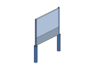 

Create a 3D model of the noise barrier with all ist components based on the Excel file
- Pire - Pile, Plinth - Panel
    - setting of the **format** (pen, stroke, color, layer, texture) for each kind of component
    - determin their **material parameters** for weight calculation
- Create objects
    - setting of the **format** (color, layer) for the numbering
    - selection of the **Excel file** and sheet

As soon as a sheet is selected a **preview** shows the potential model at the place of the underlying path course. With the **Create** button all noise barrier components are created as simple 3D bodies but with all relevant parameters as **attributes** in the current active drawing file. The single panels in each segment are also collocated into **element groups**. The pile numbering is drawn as 2D text
>**HINT**: in choosing another Excel file or sheet, several noise barrier models can be created at once as the palette stays open
##
### Step VII: PythonPart DrawWallElevations

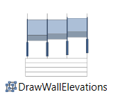 

Draw a **2D longitudinal elevation** of the noise barrier together with a dynamic parameter table based on the Excel file
- Pire - Pile, Plinth - Panel
    - setting of the **format** (pen, stroke, color, layer, filling) for each kind of component
- Content table
    - setting if the table should be shown and definition of its **layer**
    - determin **total number** and **parameter** for each **row** of the dynamic table
- Content graphic
    - setting wich **lables** should be shown and definition of their **layer**
    - setting of the creation and **format** (pen, stroke, color, layer) for each possible **curve** and if they should be shown
- Create objects
    - selection of the **Excel file** and sheet

Once file and sheet are selected, in clicking the **Input** button for the placement point a **preview** of the elevation is shown at the crosshair and can be placed with another click in the viewport. It can be adapted in content and appearance. With the **Create** button the elevation of the noise barrier is created as **2D drawing** in the current active drawing file
>**HINT**: as the palette stays open, it is possible to draw several elevations or the same one with different content / placement in choosing another placement point,  or chosing another Excel file or sheet and clicking the **Input** button again
##
### Step VIII: PythonPart DrawWallSections

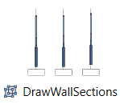 

Draw one or several **2D sections** of the individual noise barrier segments together with compact parameter tables and the related dimensioning
- Pire - Pile, Plinth - Panel
    - setting of the **format** (pen, stroke, color, layer, filling) for each kind of component
- Table - Dimesioning
    - setting of the **format** (pen, stroke, color, layer) and if the components should be shown
    - determin **total number** and **parameter** for each **row** of the dynamic table
- Content graphic
    - setting of the creation and **format** (pen, stroke, color, layer) for the terrain and gradient **curves** and if they should be shown
- Create objects
    - selection of the **Excel file** and sheet
    - determin the segment (pile) **numbers** sections should be drawn from
    - define the **distance** at which they are placed

Similar to the elevation drawing, once file, sheet and pile numbers are selected, in clicking the **Input** button for the placement point a **preview** of the them is shown at the crosshair and can be placed with another click in the viewport. It can be still be adapted untill pressing the **Create** button. With this the section(s) of the choosen noise barrier segments are created as **2D drawings** in the current active drawing file
>**HINT**: it is possible to draw several or even all segment sections at once, as for the numbering both single or sequences of number can be set and also execute the creation several times for different noise barriers

##
### Step IX: Noise barrier evaluation

> ⚠️ **IMPORTANT**:
> The evaluation is only possible for **3D objects** created with the **CreateWallComponents** PythonPart

Generate **reports** or **Excel schedules** of the noise barrier model components and the assigned paremeters
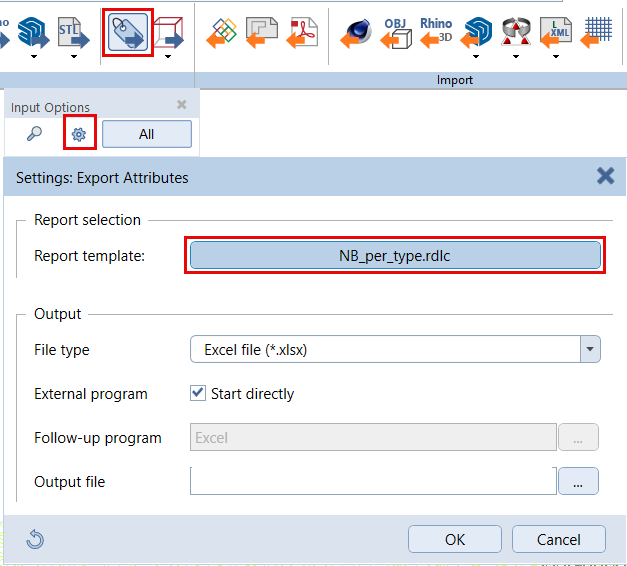               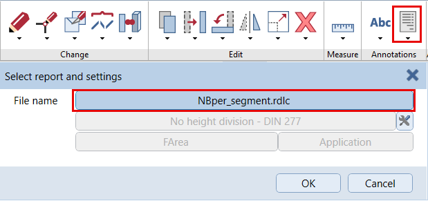
- activation of the relevant drawing file(s) and layers
- call the **Reports** or **Export Attributes** function from the ActionBar
- choosing of the desired ***.rdlc file** (per component or per segment)
- selection of the objects to be evaluated

Depending on the executed function either an **ALLPLAN report** or an **Excel file** is created and can be saved for further use. It evaluates both geometrie and additional attributes like material values
>**HINT**: all report templates contain a **zoom and highlight** option to identify the location of the listed objects in the drawing file in clicking on the graphic or grey box here

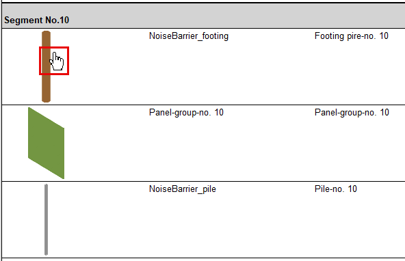               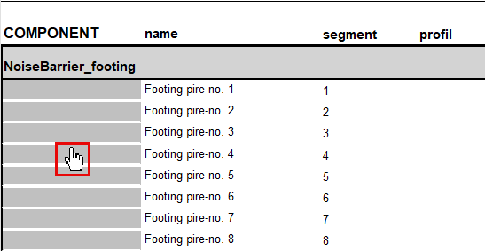
#
## Table of noise barrier component attributes

| component    | attribute | value / remark  |
| -------- | ------- | ------- |
| **pire**  | Naming   | NoiseBarrier_footing | 
|   | Name     | Footing pire-no. x |
|      | IfcEntity    | IfcFooting |
|   | Total length     | lenght in [m] |
|      | Total_weight    | based on material density |
|   | Number     | segment number |
|      | Object_name    | NoiseBarrier_object |
| **pile**  | Naming   | NoiseBarrier_pile | 
|   | Name     | Pile-no. x |
|      | IfcEntity    | IfcColumn |
|      | Profile name    | section profile name |
|   | Total length     | height in [m] |
|      | Total_weight    | based on material density |
|   | Number     | segment number |
|      | Object_name    | NoiseBarrier_object |
| **plinth**  | Naming   | NoiseBarrier_plinth | 
|   | Name     | Plinth-no. x |
|      | IfcEntity    | IfcWall |
|      | Total_weight    | based on material density |
|   | Number     | segment number |
|      | Object_name    | NoiseBarrier_object |
| **panel**  | Naming   | NoiseBarrier_panel | 
|   | Name     | Panel-no. x_x.x (segment number_number.total_number) |
|      | IfcEntity    | IfcWall |
|   | Number     | x.x (number.total number) |
|      | Object_name    | NoiseBarrier_object_part |
| **panel group**  | Naming   | Panel-group-no. x | 
|   | Name     | Panel--group-no. x |
|      | IfcEntity    | IfcElementAssembly |
|   | Number     | segment number |
|      | Number of times    | number of panels |
|   | View area     | complete panel area [m²] |
|      | Object_name    | NoiseBarrier_object |

# Anleitung NoiseBarrierTool